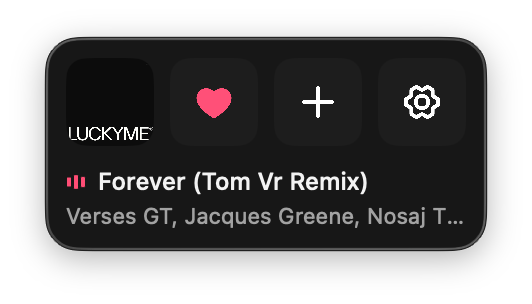

# Music Bar

A tiny macOS menu bar app that makes it easy to heart songs and add them to playlists in Apple Music.



Apple Music's desktop UI requires too many clicks for the two most common mid-listen actions. Music Bar puts them one click away.

## What it does

Four icons live in your menu bar popover:

| Icon | Action |
|------|--------|
| Album art | Shows what's currently playing — hover to reveal play/pause, click to toggle |
| Heart | Toggle love on the current track |
| Plus | Add/remove current track from your chosen playlist |
| Gear | Open settings |

- **Play/pause** by hovering over the album art and clicking — the overlay shows the current action
- **Skip next** button sits next to the artist name for quick track advancing
- **Heart** and **Plus** are toggles — they show the current state and flip it on click
- **Plus** checks for duplicates — won't add a song that's already in the playlist
- Long song titles scroll like a ticker tape
- Global keyboard shortcuts: `⌃⌥L` to love, `⌃⌥P` to add to playlist (customizable in settings)

## Requirements

- macOS 26 (Tahoe) or later
- Apple Music with an active subscription
- Xcode 26+ to build from source

## Building

```bash
git clone https://github.com/mwdwrd/music-bar.git
cd music-bar

# Requires xcodegen: brew install xcodegen
xcodegen generate

# Build and run
open MusicBar.xcodeproj
```

## First launch

1. Grant Apple Music access when prompted
2. Grant automation access to the Music app when prompted
3. Click the gear icon to pick which playlist the **+** button saves to
4. Optionally customize keyboard shortcuts in settings

## How it works

- **Now-playing**: Polls Music.app via AppleScript every 2s (`SystemMusicPlayer` is unavailable on macOS)
- **Love + playlist**: AppleScript (MusicKit write APIs are unavailable on macOS)
- **Artwork**: AppleScript with MusicKit catalog fallback
- **Shortcuts**: [KeyboardShortcuts](https://github.com/sindresorhus/KeyboardShortcuts)
- **Icons**: [Phosphor](https://phosphoricons.com) via [phosphor-icons/swift](https://github.com/phosphor-icons/swift)
- **Design**: macOS 26 Liquid Glass

## License

MIT
